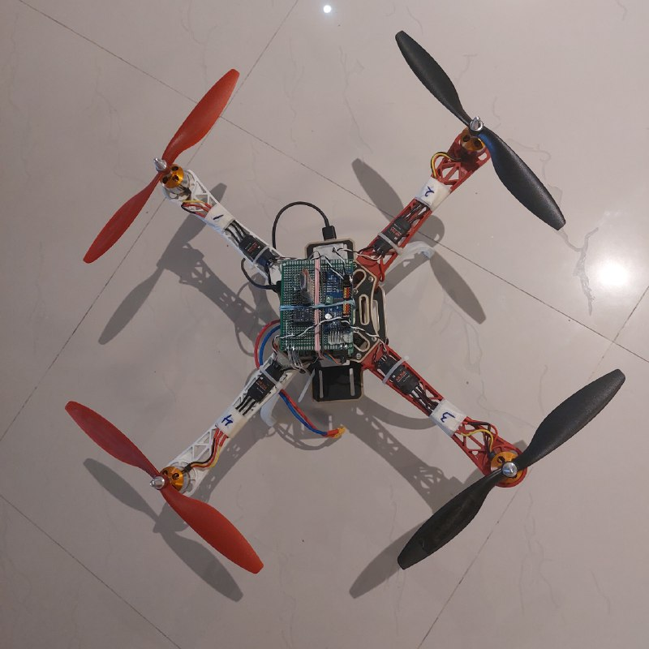

# Raspi-Kapta

This is a Raspberry pi Based flight controller that can be applied to almost any flying vehicle.

The motivation was to create an open-source, modular, easy-to-maintain platform and foundation based on a processor with enough computational capability. So, each new algorithm can be implemented and tested easily on flying vehicles, no matter their computational cost.

---

## The code contains several parts. But first, let's get to the schematics

### **Hardware**

First, the hardware contains three parts, and all of them are connected via I2C.
To get the fastest behaviour, fast(400KHz) I2C is enabled on the Raspberry pi, which can be applied as described [here](https://www.raspberrypi-spy.co.uk/2018/02/change-raspberry-pi-i2c-bus-speed/).

#### **1. Receiver Inputs**

The receiver inputs have to be read.
An Arduino module reads all the receiver inputs with an interrupt routine and sends it over I2C on the 0x08 address.

Receiver outputs are connected to Arduino in this setup:
| **Receiver Channel** | **Arduino Interrupt Pin** |
|:--------------------:|:-------------------------:|
|           1          |             8             |
|           2          |             9             |
|           3          |             10            |
|           4          |             11            |

>***Note:*** Code for the Arduino itself is located in the [this](https://github.com/BanaanKiamanesh/Raspi-Kapta/tree/main/ArduinoI2CReceiver) folder.

#### **2. IMU(BNO055)**

A BNO055 BOSCH IMU is used for the feedback.
This is a high-quality Inertial measurement unit with precise outputs calculated with Kalman filtering. All the sensor outputs are available through the class created for the purpose.

#### **3. Motor Driver(PCA9685)**

PCA9685 LED driver module is used for creating the PWM signals necessary for driving the motors.

>***Note:*** I made a circuit like this which connects to the Raspberry pi I2C pins.

---

### **Software**

The is so easy to maintain.

There is a file in the [data folder](https://github.com/BanaanKiamanesh/Raspi-Kapta/tree/main/data) where the motor pins are stored and can be modified.

Also there are lots of tools made for testing each component.

1. IMU Calibration and testing.
2. IMU offset Calculation.
3. Reciever input testing.
4. ESC calibration
5. ESC testing.
6. Killing the Motors(Stopping them of spinning).

>***Note:***For the tuning of the controller, PID gains of each axis can be determined in the data folder.

#### **Controller:**

For the controller, a very precise Anti-Windup PID Controller is used with a lowpass filter cascaded to the derivative block(where Tau can be set to zero to deactivate it).

### **To do list:**

- [x] Flight Controller
- [x] Tools
- [ ] Setup Sequence for the motor pins
- [ ] Arming and DisArming Functionality
- [ ] Upgrading for 8 Channel Radio Controller
